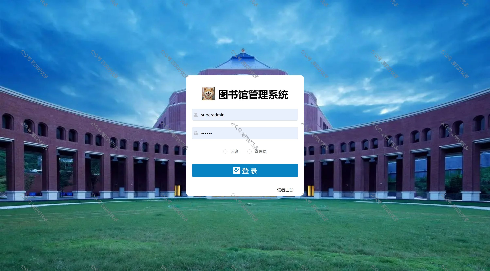
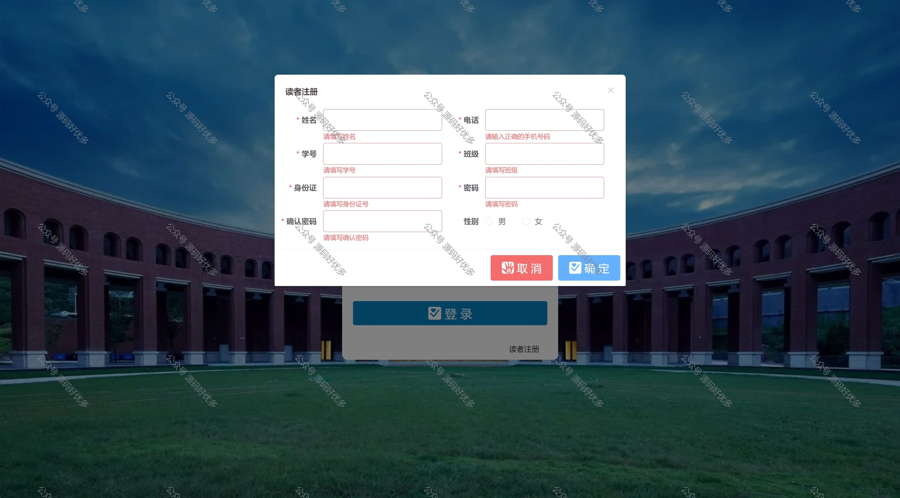
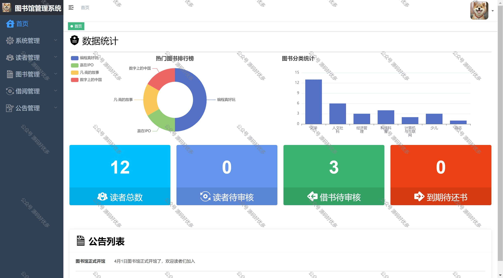
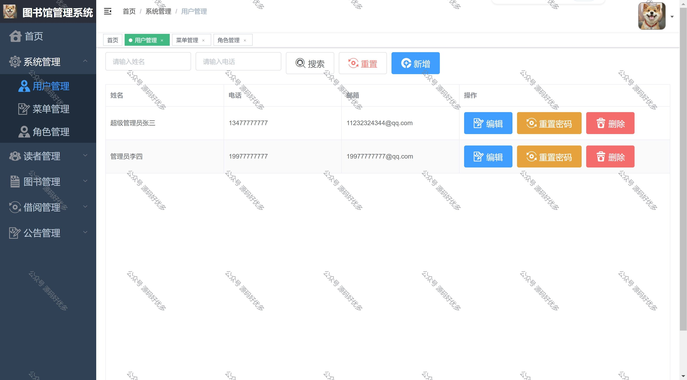
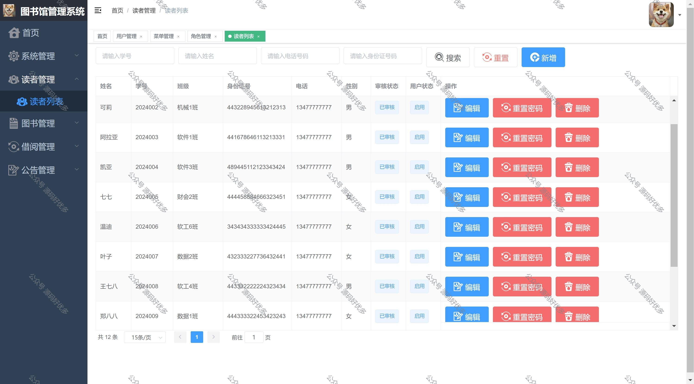
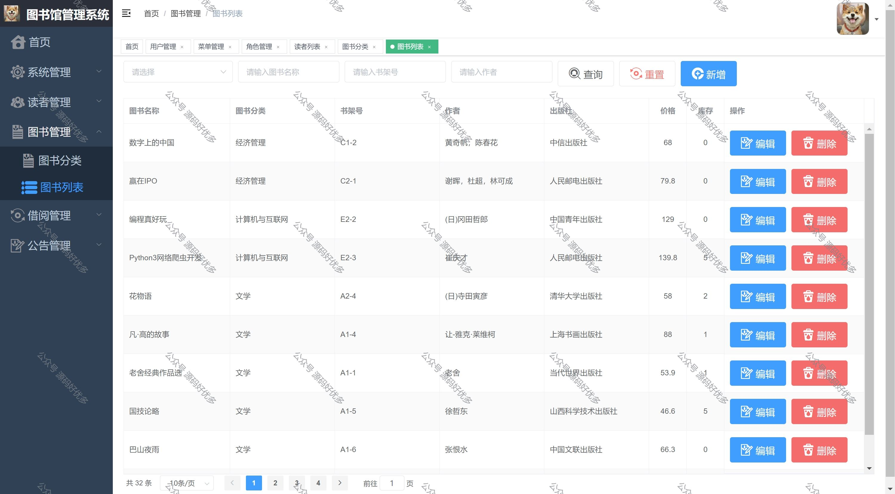
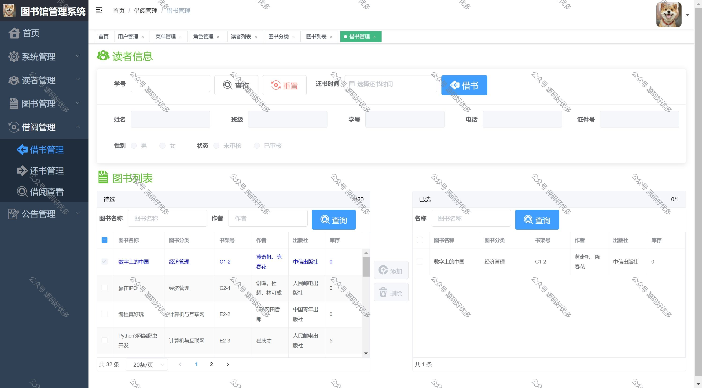
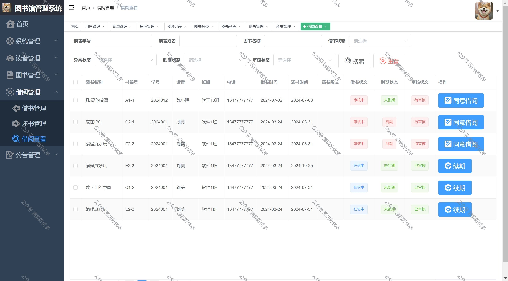
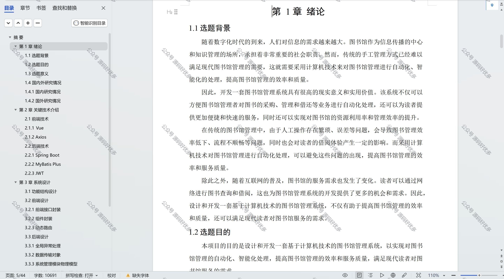

 
## 查看主页获取源码

> **作者介绍**： **✌**全网粉丝10W+本平台特邀作者、博客专家、CSDN新星计划导师、java领域优质创作者,博客之星、掘金/华为云/阿里云/InfoQ等平台优质作者、专注于毕业项目实战 **✌**

  

### 一、作品包含

源码+数据库+设计文档万字LW+PPT+全套环境和工具资源+部署教程

### 二、项目技术

前端技术：Html、Css、Js、Vue、Element-ui

数据库：MySQL

后端技术：Java、Spring Boot、MyBatis

  

### 三、运行环境

开发工具：IDEA/eclipse

数据库：MySQL8.0

数据库管理工具：Navicat10以上版本

环境配置软件： JDK1.8+Maven3.6.3

前端Nodejs：16

  

### 四、项目介绍
项目编号：springbootA021

管理员端：
系统管理，用户管理，菜单管理，角色管理 读者管理，读者列表，图书管理，图书分类，图书列表，借阅管理，借阅管理，还书管理 借阅查看，公告管理，公告列表

读者端：
借阅管理，借阅查看， 公告管理，公告列表

### 五、运行截图

  

